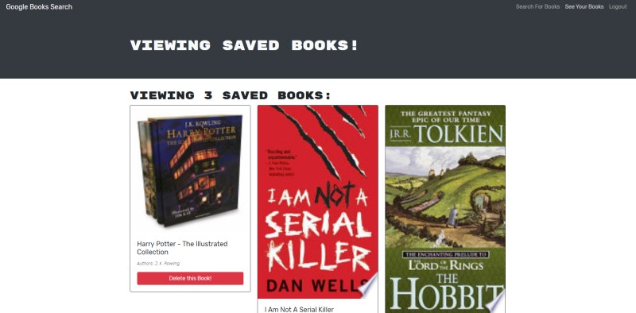

<h1 align="center">MERN Book Search Engine</h1>

<p align="center">
    
    
    
    
    
    
</p>

<p align="center">
    
</p>


## Table of Contents
- [Description](#description)
- [Installation](#install)
- [Usage](#usage)
- [Questions](#questions)

## Description
### This is a MERN stack application that uses the Google Book API to allow users to search for any book. The application allows the User to signup and log in, which lets them save searched books of their choosing.   
### The Application uses all levels of the MERN stack with a MonogoDB database, Express.js, React with the [Create React App](https://create-react-app.dev/), and finally Node.js.  
  


## Install
If you would like to clone and use this application then clone the repo (Link found down below). Once cloned enter the root folder and ---  

```
npm install
```

## Usage
### Once install is complete run 
```
npm start
```  
Page will open in browser automatically or go to localhost:3000/

## Below is a link to the GitHub repository   
[Book Search Engine](https://github.com/mattkohl82/book-search-engine)    

### GH pages deployed site 
[Book Search Engine](https://booksearch85.herokuapp.com/) 


## Questions
### [Mattkohl82 for GitHub](https://github.com/Mattkohl82)  
### mattkohl82@gmail.com for ✉️ email 